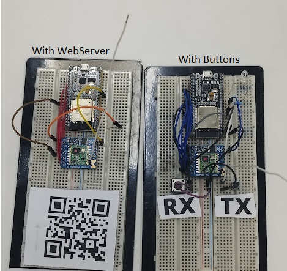

# ESP32 - RFM69

OOK Cloner with ESP32 and RFM69, working with 315MHz, 443MHz and 915MHz

## Installation (Components)

```Shell
git clone https://github.com/nopnop2002/esp-idf-rf69
cd esp-idf-rf69
idf.py set-target {esp32/esp32s2/esp32s3/esp32c3}
idf.py menuconfig
idf.py flash
```

## Installation (Cloner)

```Shell
git clone https://github.com/clopso/esp32-rfm69-ook-cloner.git
cd RFM69
idf.py set-target {esp32/esp32s2/esp32s3/esp32c3}
idf.py menuconfig
idf.py flash
```

## Photos



## Wirering

|RFM69||ESP32|
|:-:|:-:|:-:|
|MISO|--|GPIO19|
|SCK|--|GPIO18|
|MOSI|--|GPIO23|
|CSN|--|GPIO5|
|RESET|--|GPIO4|
|G0|--|GPIO2|
|G2|--|GPIO27|
|GND|--|GND|
|VCC|--|3.3V|
|LED|--|GPIO26|
|RX BTN|--|GPIO32|
|TX BTN|--|GPIO35|

##

## Software to help

[sdrsharp](https://www.scivision.dev/sdr-sharp-ubuntu/)

[URH](https://github.com/jopohl/urh)

## Hardware to help

[RTL-SDR](https://www.rtl-sdr.com/buy-rtl-sdr-dvb-t-dongles/)

[DSCope Oscilloscope](https://www.dreamsourcelab.com/product/dscope-series/)

### Ref Links

[RF 433.92MHz OOK frame cloner](https://github.com/texane/ooklone)

[OOK transceiver library](https://github.com/kobuki/RFM69OOK)

[RMT docs](https://docs.espressif.com/projects/esp-idf/en/v4.2.3/esp32/api-reference/peripherals/rmt.html)
